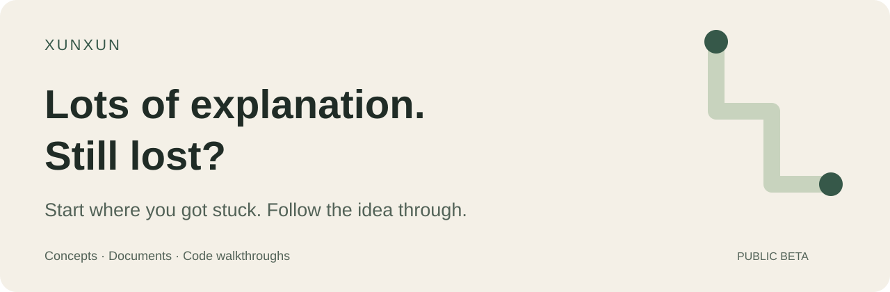

<p align="center"><a href="README.md">简体中文</a> · <strong>English</strong></p>

<p align="center">
  
</p>

<p align="center">
An agent skill for learning concepts, reading documents, and understanding codebases.<br>
Follow the main path, fill in missing background, then pick up where you left off.
</p>

<p align="center">
<a href="#see-how-it-works">See how it works</a> · <a href="#quick-start">Quick start</a> · <a href="#what-you-can-learn">Teaching routes</a> · <a href="#about-the-author">Author</a>
</p>

## When the explanation loses you

You ask how a program works. The answer starts with runtimes, contexts, and dependency injection. Every unfamiliar term leads to three more. By the time those make sense, you've lost track of the code you wanted to read.

Xunxun gives your agent a consistent way to handle that: answer the question you're stuck on, explain unfamiliar terms briefly, and introduce detail when it helps you follow the main idea.

A skill is a set of instructions your AI tool reads. Xunxun requires a tool that supports skills and local file access. It does not include a chat application or a model subscription.

## See how it works

**“How does `services["search"]` give me an object?”**

Here's a small runnable example. The explanation below is an edited illustration of the intended workflow, not a winning answer from a controlled test.

```python
class Search:
    def query(self, text):
        return text.upper()

services = {}
services["search"] = Search()

def handle(text):
    search = services["search"]
    return search.query(text)

print(handle("hello"))  # HELLO
```

**Start with the immediate question:**

> `Search()` creates the object. The assignment stores it in a dictionary under the key `"search"`. Reading `services["search"]` later retrieves that same object.

| Code | What happens |
|---|---|
| `Search()` | Creates an object that can handle a query |
| `services["search"] = Search()` | Stores the object under a name you can look up |
| `search = services["search"]` | Retrieves the existing object |
| `search.query("hello")` | Calls its method and returns `"HELLO"` |

**Then you ask: “So the string search turns into an object?”**

> No. `Search()` created the object; the string is just its lookup key. Trying `services["missing"]` would fail. Writing a name doesn't create an object.

If dictionaries are still unfamiliar, explain key-value lookup first, then return to `handle()`: retrieve the object, call its method, return the result. A question about one line should not require a tour of an entire framework.

[More evaluated examples and counterexamples](examples/reviewed-evidence-v2.md) (English guide; historical raw answers retain their original language).

## Quick start

### 1. Install

Ask an AI tool that supports skill installation:

```text
Install this skill:
https://github.com/stveshawn1/xunxun-skill
```

Or run the following in a terminal with Node.js and `npx` installed, then select your AI tool:

```bash
npx skills add stveshawn1/xunxun-skill --skill xunxun -g
```

The `-g` flag installs it for your user account so you can use it across projects. Omit the flag for a project-local installation.

<details>
<summary>Choose an agent, check the installation, or update</summary>

Codex:

```bash
npx skills add stveshawn1/xunxun-skill --skill xunxun -g -a codex
```

Claude Code:

```bash
npx skills add stveshawn1/xunxun-skill --skill xunxun -g -a claude-code
```

Check and update:

```bash
npx skills list -g
npx skills update xunxun -g
```

See the [Vercel Skills CLI documentation](https://github.com/vercel-labs/skills). This repository's evaluations run through Codex; they do not establish compatibility or teaching quality across every supported agent. Installation uses GitHub directly and does not depend on a skills.sh search listing.

</details>

### 2. Ask something you actually want to understand

In a new conversation that can load the installed skill:

```text
Use xunxun to explain TypeScript type erasure.
I have only written a little Python.
```

For a code walkthrough, open the project first:

```text
Use xunxun to walk me through this codebase.
Trace one real user request from entry point to output.
```

If something still doesn't make sense, ask normally: “If the types are erased, what checks the input at runtime?” You don't need to select a preset or learn a feedback command.

## What you can learn

A preset is a teaching route chosen for your question and material. Xunxun uses three routes, with more specific approaches when needed.

| Route | Useful for | Approach |
|---|---|---|
| Concepts | Confusing terms, unfamiliar formulas | Compare the same example under both concepts, or work through a small numerical example |
| References | Documents, papers, configuration, functions | Establish the role or question, then connect evidence, inputs, outputs, and relevant details |
| Codebases | Execution flow and object lifecycles | Follow one real operation and connect the modules, state, and ownership along the way |

For example:

```text
Use xunxun to explain what this configuration changes at runtime.
Use xunxun to walk me through this paper's central argument.
Use xunxun to explain who creates and disposes of this service.
```

[Read the practical teaching routes](references/teaching-routes.md). Ordinary planning, code review, and implementation requests should not automatically activate teaching.

## Keep a preference or continue a project lesson

To retain a teaching preference, ask explicitly:

> Remember: define unfamiliar concepts before giving a simple example.

To save your place in a project:

> Save where we stopped, our open questions, and the next step locally in this project.

| Location | Contents |
|---|---|
| `~/.xunxun/profile.md` | Cross-project preferences you've asked or agreed to retain |
| `<project-root>/.xunxun/profile.md` | Learning progress, open questions, and the next step for this project |
| Current conversation | Temporary questions and explanation adjustments |

Profiles are not created by default. They are local Markdown files. Xunxun instructs the agent to exclude private project notes from Git and does not automatically upload or synchronize them across devices. Your AI tool still reads this context under its own data-handling rules; local storage does not mean offline model processing.

## Status and evaluation

Xunxun is in **public beta**. Its instructions guide teaching behavior; the outcome depends on the model, material, and question. The examples here show how to use it, not a guarantee of improved learning.

The [current diagnostic evaluation](evals/2026-09-08-v3/report.md) compares default answers, a short teaching prompt, and the full skill. Methods, raw outputs, and limitations are included. [Earlier examples](examples/reviewed-evidence-v2.md) show both helpful answers and cases where the skill added unnecessary explanation.

<details>
<summary>Earlier results and a metric correction</summary>

[V1](evals/2026-09-03-v1/report.md) found no clear advantage. [V2](evals/2026-09-03-v2/report.md) found gains concentrated in accounting questions, not a general benefit or evidence of long-term personalization.

The metric labeled “fact coverage” in v2 was actually:

```text
(covered_required_facts - forbidden_inferences) / total_required_facts
```

That is a combined score, not pure coverage. Historical reports and raw outputs are frozen. To verify their integrity, check out `7a2f074` separately and run `python3 evals/2026-09-03-v2/verify.py`. Those tests do not validate the current revision.

</details>

## About the author

Built by **SteveS**. Xunxun grew out of repeatedly refining how AI explained unfamiliar concepts and code during the author's own learning.

SteveS also shares that process on [Xiaohongshu](https://www.xiaohongshu.com/user/profile/684f805c000000001d035fa4) (in Chinese).

If an explanation still leaves you stuck, [open an issue](https://github.com/stveshawn1/xunxun-skill/issues) with the question and a short, privacy-safe excerpt. You do not need to share a full conversation or a personal profile.

<details>
<summary>Explore the implementation</summary>

[SKILL.md](SKILL.md) · [Adapting to feedback](references/adaptive-learning.md) · [Local state](references/local-state.md) · [Evaluation method](references/comparison-protocol.md)

</details>
