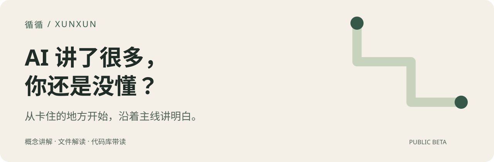

<p align="center"><strong>简体中文</strong> · <a href="README.en.md">English</a></p>

<p align="center">
  
</p>

<p align="center">
一个帮 AI 带你学概念、读材料、看懂代码库的 Skill。<br>
先讲清主线；补完前置知识，再带你回到刚才的代码。
</p>

<p align="center">
<a href="#看它怎么讲">看它怎么讲</a> · <a href="#开始用">安装与开始</a> · <a href="#可以拿来学什么">讲解路线</a> · <a href="#关于作者">作者</a>
</p>

## 你可能也遇到过

本来想看懂代码，AI 开口就是 runtime、context、dependency injection。每解释一个词，又冒出三个词。问了半天，最初那条主线已经找不回来了。

循循把这些反馈整理成可安装的讲解规则：先回答你卡住的问题，新名词补一句直观解释，需要看细节时再往下走。你不用每次从头交代“别一上来就堆术语”。

Skill 是供 AI 读取的工作指引，需要搭配支持 Skills、能读取本地文件的 AI 工具使用。循循没有独立聊天窗口，也不提供模型服务。

## 看它怎么讲

**“为什么写 `services["search"]` 就能拿到一个对象？”**

下面是一个可运行的小例子。讲解经过编辑，用于展示预期使用方式，不是对照实验中的胜出回答。

```python
class Search:
    def query(self, text):
        return text.upper()

services = {}
services["search"] = Search()

def handle(text):
    search = services["search"]
    return search.query(text)

print(handle("hello"))  # HELLO
```

**先把眼前的问题讲清楚：**

> `Search()` 创建对象，`services["search"] = ...` 把它保存到字典里。后面读 `services["search"]`，取出来的是之前存好的那个对象。

| 代码 | 发生了什么 |
|---|---|
| `Search()` | 创建一个能处理查询的对象 |
| `services["search"] = Search()` | 给这个对象一个可以查找的名字 |
| `search = services["search"]` | 按名字取出已存在的对象 |
| `search.query("hello")` | 调用它的方法，得到 `"HELLO"` |

**你接着问：“所以是字符串 search 变成了对象？”**

> 没有。对象是 `Search()` 创建的；字符串只是查找它的键。就像同一个字典里 `services["missing"]` 会找不到，写一个名字不会自动生成对象。

如果你还没学过字典，就先补上键值查找，再回到 `handle()`：取出对象、调用方法、返回结果。循循的路线要跟着这个卡点走，不必为了回答一行代码先讲完整个框架。

[更多实际评测与反例（英文导读，原始回答保留原语言）](examples/reviewed-evidence-v2.md)

## 开始用

### 1. 安装

在支持安装 Skills 的 AI 工具里发送：

```text
Install this skill:
https://github.com/stveshawn1/xunxun-skill
```

或者在终端执行（需要 Node.js 和 `npx`），按提示选择你的 AI 工具：

```bash
npx skills add stveshawn1/xunxun-skill --skill xunxun -g
```

`-g` 安装到个人目录，方便跨项目使用；只想装在当前项目就去掉它。

<details>
<summary>指定工具、检查安装和更新</summary>

Codex：

```bash
npx skills add stveshawn1/xunxun-skill --skill xunxun -g -a codex
```

Claude Code：

```bash
npx skills add stveshawn1/xunxun-skill --skill xunxun -g -a claude-code
```

检查与更新：

```bash
npx skills list -g
npx skills update xunxun -g
```

命令依据 [Vercel Skills CLI 文档](https://github.com/vercel-labs/skills)。本仓库的评测通过 Codex 运行，不表示逐一验证了所有工具。安装直接读取 GitHub，不依赖 skills.sh 搜索收录。

</details>

### 2. 选一个真正没懂的问题

安装后，在能够加载 Skill 的新会话中发送：

```text
Use xunxun to explain TypeScript type erasure.
I have only written a little Python. Explain in Chinese.
```

读代码时先打开项目，再发送：

```text
Use xunxun to walk me through this codebase.
Trace one real user request from entry point to output.
Explain in Chinese.
```

不理解就正常追问，例如“类型删掉了，运行时谁检查输入？”无需选择 preset 或使用特定反馈口令。提示用英文便于复制和分享，直接用中文提问也可以。

## 可以拿来学什么

Preset 是按材料和问题选用的讲解路线。循循沿用三种路线，在需要时采用对应的讲法。

| 路线 | 适合什么 | 怎么讲 |
|---|---|---|
| 概念 | 两个词总混淆、公式看不懂 | 同一例子比较差异，或用一组数字走通计算 |
| 材料 | 文件、论文、配置、函数 | 先讲角色或问题，再连起证据、输入输出与关键细节 |
| 代码库 | 想知道程序怎么跑、对象谁创建谁销毁 | 跟随一次真实执行，逐步接上模块、状态与生命周期 |

你可以直接要求：

```text
Use xunxun to explain what this configuration changes at runtime.
Use xunxun to walk me through this paper's central argument.
Use xunxun to explain who creates and disposes of this service.
```

[详细场景与选路规则（英文）](references/teaching-routes.md)。正常讨论方案、评审或修改代码时，循循不应自动介入教学。

## 记住讲法，下次接着学

想保留讲解习惯，明确说：

> 记住：讲陌生概念时，先给定义，再给一个简单例子。

想保存项目学习进度，可以说：

> 把我们学到哪里、还卡在哪里和下一步保存在这个项目里。

| 位置 | 保存什么 |
|---|---|
| `~/.xunxun/profile.md` | 你要求或同意保留的跨项目讲解偏好 |
| `<project-root>/.xunxun/profile.md` | 本项目的学习位置、未解决问题和下一步 |
| 当前对话 | 临时疑问和正在尝试的讲法 |

默认不创建画像。记录是本地 Markdown 文件；循循要求 Agent 防止私有项目记录进入 Git，不自动上传或跨设备同步。你的 AI 工具仍会读取这些内容并按自身的数据处理方式运行，不能理解为完全离线。

## 使用状态与评测

循循目前是 **public beta**。它提供讲解规则，效果取决于模型、材料和具体问题。首页展示用法，不把模型裁判的偏好分数当作学习效果保证。

[新版诊断评测](evals/2026-09-08-v3/report.md)比较默认回答、简短教学提示和完整循循。原始输出、方法和不足一并保留。[旧版案例](examples/reviewed-evidence-v2.md)也保留，方便检查哪些场景有帮助、哪些会讲重。

<details>
<summary>旧版结果与指标修正</summary>

[v1](evals/2026-09-03-v1/report.md) 未测出明显优势。[v2](evals/2026-09-03-v2/report.md) 的收益集中在财务题，不能推出普遍有效，也未验证长期个性化。

v2 中称为“事实覆盖率”的指标实际是：

```text
(covered_required_facts - forbidden_inferences) / total_required_facts
```

这是综合分数，不是纯覆盖率。旧报告与原始结果保持冻结；若复核其完整性，在独立 checkout 中检出 `7a2f074`，运行 `python3 evals/2026-09-03-v2/verify.py`。旧实验不代表当前版本已通过同一评测。

</details>

## 关于作者

我是 **SteveS**。循循来自我用 AI 学概念、读代码时反复调整讲解方式的经历。

我也在[小红书](https://www.xiaohongshu.com/user/profile/684f805c000000001d035fa4)分享使用过程。

如果某个问题始终讲不明白，欢迎在 [Issues](https://github.com/stveshawn1/xunxun-skill/issues) 留下问题和一小段去除隐私后的回答。无需上传完整对话或个人画像。

<details>
<summary>查看实现</summary>

[SKILL.md](SKILL.md) · [反馈适应](references/adaptive-learning.md) · [本地状态](references/local-state.md) · [评估方法](references/comparison-protocol.md)

</details>
